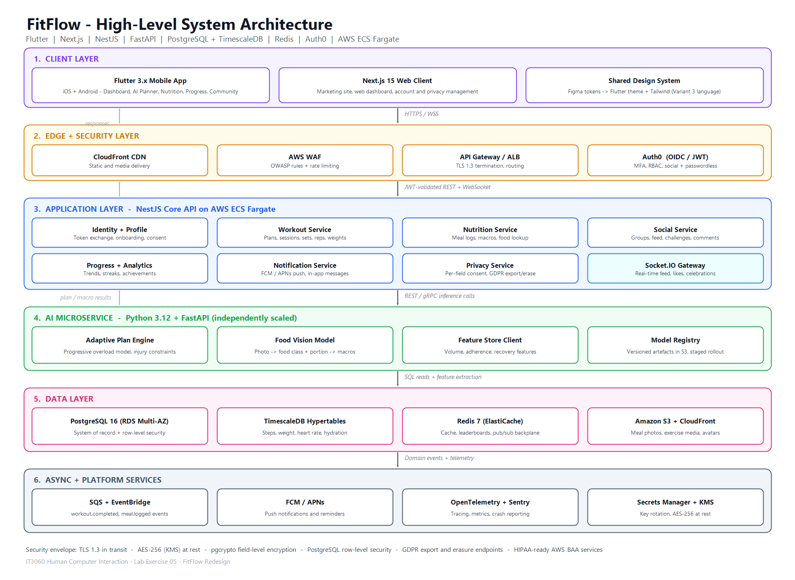
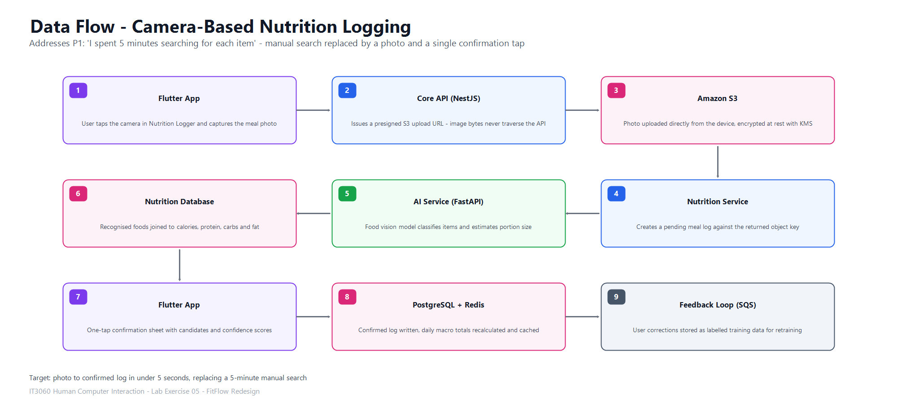

# FitFlow High-Level Architecture

---

## 1. Architectural style

FitFlow uses a **layered, service-oriented architecture**. It has a shared client layer, an edge
and security layer, a modular NestJS core API, a Python AI microservice deployed on its own, and a
data layer that uses more than one kind of store. Requests a user is waiting on travel
synchronously over REST and gRPC. Work that should not block anyone, such as analytics rollups,
achievement checks and model feedback, goes through SQS and EventBridge instead.

---

## 2. Components

### 2.1 Client layer

| Component | Technology | Responsibility |
|---|---|---|
| Mobile app | Flutter 3.x | All five core screens (Dashboard, AI Workout Planner, Nutrition Logger, Progress, Community), camera capture, and an offline cache using Isar or SQLite |
| Web client | Next.js 15 | Marketing site, web dashboard, account settings and privacy management |
| Design system | Figma tokens into a Flutter theme and Tailwind config | Keeps the Variant 3 visual language consistent across platforms |

### 2.2 Edge layer

CloudFront CDN, AWS WAF with the OWASP rule set and rate limiting, and API Gateway or ALB handling
TLS 1.3 termination. JWTs are validated against the Auth0 JWKS endpoint before any request reaches
a service.

### 2.3 Core services (NestJS on ECS Fargate)

| Service | Responsibility |
|---|---|
| Identity and Profile | Auth0 token exchange, user profile, onboarding answers, consent records |
| Workout | Plan lifecycle, session logging, sets, reps and weights, and orchestration of AI plan generation |
| Nutrition | Meal logs, daily macro totals, food database lookup, photo-log reconciliation |
| Social | Groups, feed, posts, likes, comments, challenges, privacy-filtered fan-out |
| Progress and Analytics | Weight, step and calorie trends, streaks, achievements, milestone checks |
| Notification | Push through FCM and APNs, in-app messages, encouraging return notifications |
| Privacy | Per-field sharing settings, and GDPR export and erasure orchestration |

### 2.4 AI microservice (Python FastAPI)

| Module | Responsibility |
|---|---|
| Adaptive plan engine | A progressive-overload model over session history that respects injury constraints |
| Food vision | Image classification and portion estimation, mapped to the nutrition database |
| Feature store client | Reads engineered features such as volume, adherence and recovery from PostgreSQL and Redis |
| Model registry | Versioned artefacts in S3, promoted through staging before production |

### 2.5 Data layer

| Store | Purpose |
|---|---|
| PostgreSQL 16 (RDS Multi-AZ) | System of record for users, plans, sessions, meals, posts and achievements |
| TimescaleDB hypertables | Time-series metrics: steps, weight, heart rate, hydration, calories |
| Redis 7 (ElastiCache) | Session cache, daily totals, feed cache, leaderboards, Socket.IO pub/sub |
| Amazon S3 with CloudFront | Meal photos, exercise media, avatars, model artefacts |
| OpenSearch (optional) | Fuzzy food-name search for the manual logging fallback |

### 2.6 Real-time layer

A Socket.IO WebSocket gateway backed by the Redis pub/sub adapter delivers live likes, comments,
challenge leaderboard movement and workout-completion celebrations. FCM and APNs handle delivery
when the app is in the background.

---

## 3. Critical data flows

### 3.1 Personalised workout plan

1. The user opens **AI Workout Planner** and the app sends `GET /workouts/plan` with its Auth0 JWT.
2. API Gateway validates the token, then the Workout Service checks Redis for a cached current plan.
3. If nothing is cached, it loads the last 8 weeks of sessions, goals and injury flags from PostgreSQL.
4. It calls the AI service at `POST /infer/plan` with that feature payload.
5. The adaptive plan engine runs the progressive-overload model, filters exercises against injury
   constraints, and returns a structured plan with sets, reps, target weights and duration.
6. The plan is saved, cached in Redis for 24 hours, and returned to the client.
7. When the session finishes, a `workout.completed` event goes to SQS. Consumers update the
   progress aggregates, check achievements, and append a labelled training example, so the **next**
   session is adjusted. This answers P3 directly: *"Weights haven't increased in 2 weeks."*

### 3.2 Camera-based nutrition logging

1. The user taps the camera in **Nutrition Logger** and the app requests a presigned S3 URL.
2. The photo uploads straight to S3, so image bytes never pass through the API.
3. The app calls `POST /nutrition/logs/from-photo` with the object key, which creates a pending log.
4. The Nutrition Service calls the AI service at `POST /infer/food`.
5. Food vision classifies the items, estimates portion size, and returns candidates with confidence
   scores, joined to the nutrition database for calories and macros.
6. The client shows a one-tap confirmation sheet, and the user confirms or corrects it.
7. The confirmed log is written to PostgreSQL, daily totals are recalculated and cached in Redis,
   and corrections are kept as training labels. Logging drops from the five minutes P1 reported to
   a few seconds.

### 3.3 Social sharing

1. The user publishes a post or workout result from **Community**.
2. The Social Service asks the Privacy Service what that user allows to be shared. Suppressed
   fields, such as exact body weight, are stripped before anything is saved.
3. The post is written to PostgreSQL and fanned out to follower feed keys in Redis sorted sets.
4. Followers who are connected receive it over WebSocket. Followers who are offline get an FCM or
   APNs push.
5. Likes and comments publish to Redis pub/sub and stream back live, which builds the
   accountability loop P2 asked for: *"I wish someone would check in on me."*

---

## 4. Security considerations

| Area | Control |
|---|---|
| Transport | TLS 1.3 everywhere, HSTS, and certificate pinning in the Flutter client |
| At rest | AES-256 through AWS KMS on RDS, S3 and ElastiCache, with pgcrypto field-level encryption for sensitive metrics |
| Identity | Auth0 OIDC, short-lived access tokens, rotating refresh tokens, optional MFA, and JWKS validation at the edge |
| Authorisation | RBAC roles (user, coach, moderator, admin) together with PostgreSQL row-level security, so a query can only ever reach the owner's own rows |
| Privacy | Per-field consent stored with the profile. The Privacy Service is consulted on every outbound share, and no data is sold to third parties. This answers P5 |
| GDPR | EU residency, consent captured at onboarding, and Article 20 export and Article 17 erasure endpoints that cascade into S3 media and cached entries |
| HIPAA readiness | BAA-eligible AWS services, immutable audit logs, least-privilege IAM, and an option for long-term log retention |
| Application | Input validation through class-validator and Pydantic, parameterised queries, WAF OWASP rules, rate limiting, and dependency scanning in CI |
| Secrets | AWS Secrets Manager with automatic rotation. Nothing sensitive lives in the repository |

---

## 5. Scalability considerations

- **Stateless services** on ECS Fargate scale out on CPU and request-count targets. The AI service
  scales by itself, so a spike in inference never starves the CRUD path.
- **Read replicas** take analytics and feed queries while the primary handles writes.
- **TimescaleDB continuous aggregates** work out daily and weekly rollups in advance, which keeps
  progress charts quick as a user's history grows.
- **Redis caching** soaks up read-heavy dashboard and feed traffic using cache-aside with short TTLs.
- **Asynchronous processing through SQS** smooths the evening peak, when most workouts get logged.
- **CloudFront** takes all media delivery off the origin.
- **Monthly partitioning** of session and metric tables keeps index sizes under control.

---

## 6. Integration considerations

| Integration | Purpose | Method |
|---|---|---|
| Apple HealthKit and Google Health Connect | Import steps, heart rate, sleep | Native platform channels from Flutter, synced through the Progress Service |
| Wearables (Fitbit, Garmin, Whoop) | Activity and recovery data | OAuth 2.0 with vendor REST APIs, and nightly sync jobs |
| Nutrition database (USDA FoodData Central, Open Food Facts) | Calories and macros for recognised foods | A cached lookup service backed by a local mirror |
| Firebase Cloud Messaging and APNs | Push notifications | Server SDK called from the Notification Service |
| Stripe and RevenueCat | Premium subscriptions | Entitlement updates driven by webhooks |
| Sentry with OpenTelemetry | Crash reporting and distributed tracing | An SDK in every client and service |

---

## 7. Deployment view

| Environment | Purpose | Notes |
|---|---|---|
| `dev` | Feature development | Single-AZ RDS, reduced task counts |
| `staging` | Pre-release verification | Mirrors the production topology with anonymised data |
| `production` | Live | Multi-AZ RDS, auto-scaling ECS, WAF enabled, blue/green deployment |

GitHub Actions builds and tests each service, pushes images to ECR, and deploys to ECS. Mobile
builds come out of Codemagic or Fastlane and ship through TestFlight and Play Internal Testing.
